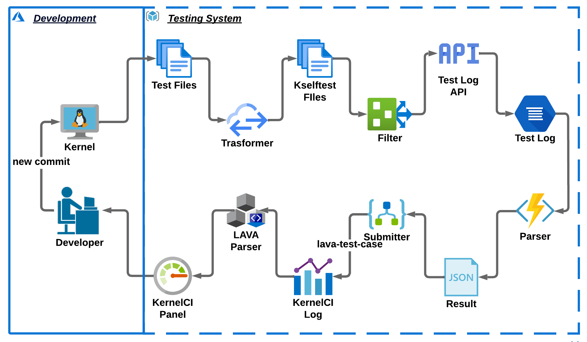

# Автоматизированное тестирование Linux

> 🌐 **Языки:** [English](./README.md) | [Русский](./README_ru.md)

 

Этот проект направлен на улучшение фреймворка самотестирования ядра Linux за счет внесения значительных улучшений в его компоненты `api`, `transformer` и `parser`. Эти улучшения призваны упростить процесс написания, управления и интерпретации самотестов ядра, сделав фреймворк более эффективным и удобным для пользователя.

## Компоненты Проекта

### [API](./api/README_ru.md).

Компонент `api` обновляет фреймворк самотестирования ядра Linux, вводя новые глобальные метаданные для информации о тестах, возможности фильтрации на разных уровнях и улучшенный формат вывода. Он устраняет проблемы, такие как бесконечные циклы в `FIXTURE_TEARDOWN`, и включает опции выбора тестов как через CLI, так и через GUI.

### [Transformer](./transformer/README_ru.md).

`Transformer` устраняет исторические несоответствия в форматах вывода тестов, преобразуя традиционные файлы тестов в файлы, использующие фреймворк kselftest. Он автоматизирует этот процесс с помощью семантических патчей Coccinelle и скриптов Python, улучшая управляемость тестовыми случаями.

### [Parser](./parser/README_ru.md).

Компонент `parser` предназначен для анализа журналов результатов запусков Kselftest, подготавливая их к отправке в системы CI. Он сравнивает три версии Parser,выделяя эффективность и оптимизацию текущей реализации в анализе и отправке результатов тестирования.

## Начало работы

Скрипт `runner.sh` предназначен для автоматизации запуска тестов определенной подсистемы TARGET в рамках самопроверок ядра Linux, как до, так и после применения трансформаций с помощью инструмента Transformer.

### Запуск тестов

Для использования `runner.sh` для запуска тестов на указанной цели TARGET, следуйте этим шагам:

```bash
# Запустить тесты для цели 'tmpfs'
./runner.sh tmpfs
```

Эта команда выполняет самопроверки для подсистемы `tmpfs`. Она автоматически проведет тесты до трансформации, применит трансформацию, а затем повторно запустит тесты после трансформации, облегчая прямое сравнение результатов.